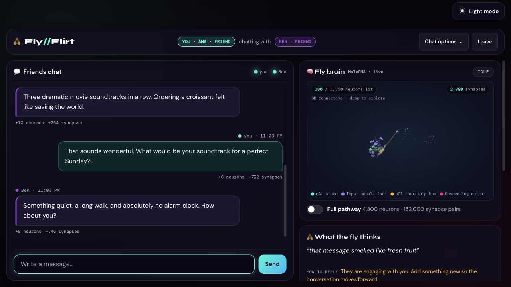
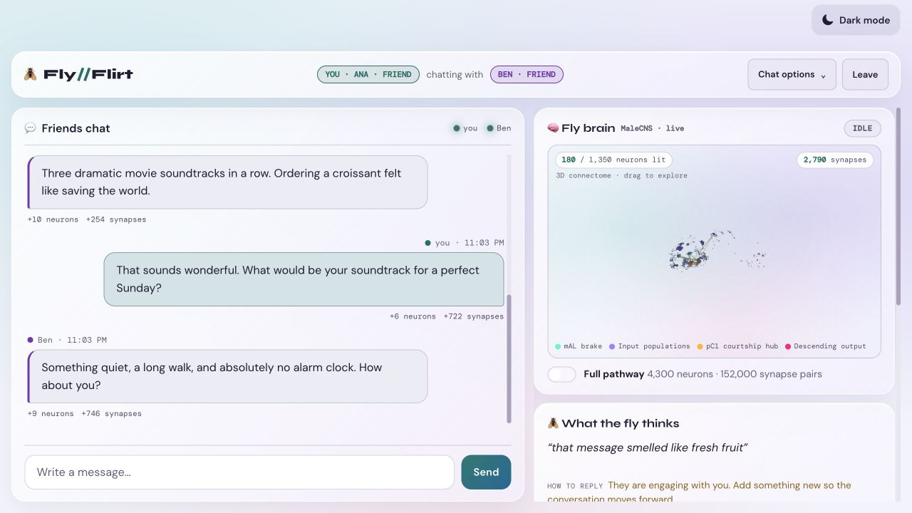
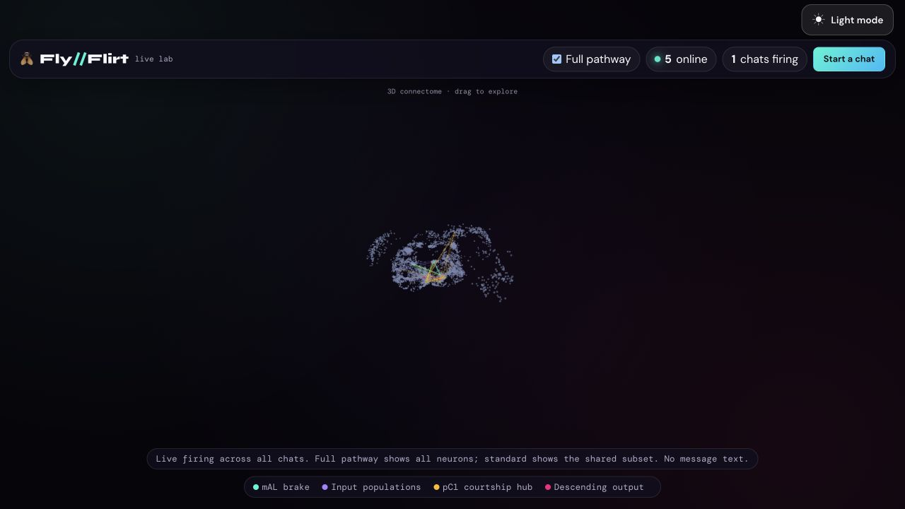

# Fly//Flirt

Two people chat (male/female "flirt" mode, or friends). Each message is scored by a Groq LLM into 7 parameters
that drive a real MaleCNS fruit-fly connectome subgraph (1,350 cells, 50,158 synapses). The chat page shows the
firing live in 3D; Live Lab combines activity across chats; the verdict page attributes every activated neuron/connection to the message that caused it.

## See it in action



Messages drive simulated activity through real neuron identities and synaptic connections. Drag the brain
to rotate it, scroll to zoom, and use the theme button to switch between dark and light mode.

The animation follows four demo messages—curiosity, humor, warmth, and personal sharing—with pauses between firing bursts.


**Live Lab (`/lab`)** overlays firing from all active chats, without message text, room IDs, or authorship.
It opens with **Full pathway** enabled when available. The standard view still receives every chat's activity,
but displays only neurons and synapses shared with its smaller graph. Activity is mapped by neuron identity,
not by reusing indices from a different graph.

The chat and lab share the 3D renderer, wave cadence, and synapse animation. Chat also retains its own
conversation's activity state; the lab overlays transient firing from multiple conversations.

| Light-mode chat | Full-pathway Live Lab |
| --- | --- |
|  |  |

*Screenshots and animation use fictional demo messages and the local heuristic scorer.
The view shows a partial fruit-fly connectome, not a full brain surface or a measure of human attraction.*

## Run locally

Use Python 3 and a virtual environment. From the repository root:

**macOS / Linux**

```sh
python3 -m venv .venv
source .venv/bin/activate
python -m pip install -r requirements-runtime.txt
cp .env.example .env
python app.py
```

**Windows (PowerShell)**

```powershell
python -m venv .venv
.venv\Scripts\python -m pip install -r requirements-runtime.txt
Copy-Item .env.example .env
.venv\Scripts\python app.py
```

Before starting, edit `.env`:

- **`SECRET_KEY`** — required. Any random string for local use; the app won't start in production without one.
- **`GROQ_API_KEY`** (`LLM_API_KEY` also accepted) — optional. Powers real LLM scoring of each message. Get a
  free key at [console.groq.com](https://console.groq.com). Without one, a local heuristic scorer takes over
  automatically — the chat, the brain, and the verdict all still fully work, just without a real model behind
  the scoring.
- **`NEUPRINT_TOKEN`** — **not needed to run the app.** The MaleCNS connectome data it uses
  (`static/connectome.json`, `static/connectome_full.json`) already ships pre-built in this repo. A neuPrint
  token is only needed if you want to *regenerate* that data yourself, via
  `python tools/build_connectome.py` — get a free one at [neuprint.janelia.org](https://neuprint.janelia.org)
  if you ever need to.

Open **http://localhost:5000** to start a chat or **http://localhost:5000/lab** for Live Lab.
To see live firing, keep both views open and send a message in an active two-person chat.

## Checks

```sh
python -m unittest discover -s tests
node --test tests/test_frontend.cjs
```

The renderer checks cover camera framing, preservation of neuron coordinates and synaptic endpoints,
and mapping activity between the standard and full graphs.

## LLM fallback
Ordered chain (`LLM_CHAIN`) of Groq models with per-model circuit breakers and local RPM/TPM/RPD/TPD accounting.
If all are unavailable a built-in heuristic scorer answers instantly, so the app never stops.

## Layout
`flyflirt/` (engine, verdict, llm/, rooms, matchmaking, sockets, web/) · `templates/` · `static/` · `tools/` (offline connectome build) · `tests/`

## Full pathway (bigger brain)
`static/connectome_full.json` (4,300 cells, 152,284 synapse pairs) is opt-in for chats: either person can flip
the "Full pathway" switch under the brain and the chat is replayed on the bigger graph for both. Rebuild it with
`python tools/build_connectome.py --context 4000 --out static/connectome_full.json` (needs `NEUPRINT_TOKEN`).
Env: `FULL_ENABLED`, `FULL_MAX_ROOMS` (concurrent full rooms, default 8; each step costs ~45 ms CPU),
`SIM_METER_SCALE_FULL` (re-fitted so both graphs read alike). Phones get a warning and a lighter render; the
page also warns if the frame rate drops below ~22 fps.

## Safety
Message filter (`flyflirt/moderation.py`: slurs, threats and sexual harassment are blocked and never reach the LLM;
profanity is starred out; emails, links and phone numbers are hidden), three strikes end the chat and ban for 15 min,
**Next person** (skipped pairs are not re-matched for 30 min), **Block** (permanent pairing ban, ~30 days),
**Report** (categories, one per reporter per room, rate-limited, three different reporters in 24 h auto-ban for 1 h),
delivery receipts ("Seen", purely live/in-memory — never written to disk), and a gentle "It's gone quiet, see your
verdict?" nudge after 5 minutes of silence in a verdict-ready chat (`IDLE_VERDICT_NUDGE_S`) that never ends or
redirects the chat on its own. Nicknames are compulsory (client pre-fills a random "emoji + adjective + noun" name
you can reroll or overwrite; server rejects a blank one too).

### Admin page
`/admin` lists unresolved reports and active bans, with buttons to resolve a report, ban the reported person for
24h, or lift a ban. It's disabled — every `/admin/*` route 404s, indistinguishable from not existing — unless
you set **both** `ADMIN_USERNAME` and `ADMIN_PASSWORD`. When set, it's gated by HTTP Basic Auth (only sensible
over HTTPS) plus a per-session CSRF token on every action, and there's no
link to it from anywhere in the app. Pick a long random `ADMIN_PASSWORD`; it's compared with a timing-safe check
but is otherwise a plain shared secret, the same trust level as `SECRET_KEY`/`GROQ_API_KEY`.

## Privacy: what's actually on disk
**Your words are not written to the server's database in a real deployment.** While a chat is live, the process
always keeps the full transcript in memory so both people can see it and so each message can be sent to Groq for
scoring — that's unavoidable to make the feature work at all. What happens when a message is *persisted* to
SQLite (for verdicts and reconnects to survive a restart) depends on how the app is running:

- **`APP_ENV=production`** (a real deployment) → text is **not** kept by default: only the
  *numbers* derived from a message are stored (the 7 LLM parameters, which neurons/synapses fired, which AI
  model was used). The message text and the fly's diary/tip paraphrase of it are stored as empty.
- **Anything else** (e.g. `python app.py` off your own clone, `APP_ENV` unset) → text **is** kept by default,
  since it's your own machine and a transcript is usually more useful there than a privacy risk.
- **`RETAIN_MESSAGE_TEXT=true`/`false`** overrides either default explicitly, server-wide.
- **Either person in a chat can override the server's choice for that one conversation**, in either direction,
  via the "Save this chat" switch under Chat options — e.g. opting out even on a server that keeps text by
  default, or opting in on one that doesn't. It only affects messages sent after the switch is changed.

Practical effect either way: the neural simulation and verdict are bit-for-bit reproducible after a server
restart; a chat whose text wasn't retained shows "(message text was not stored on the server)" in place of old
messages once restored from disk. Fully tested both ways (`tests/test_flow.py::RestoreTests`, and the
`set_privacy` tests in `ChatFlowTests`).

## Security notes
- Strict CSP (`script-src 'self'`, no inline scripts anywhere), CORS defaults to same-origin
  (`ALLOWED_ORIGINS` unset), HttpOnly + SameSite=Lax session cookie, `SESSION_COOKIE_SECURE` should be set
  `true` in production. `SECRET_KEY` is required and the app refuses to start
  without one when `APP_ENV=production`.
- Every state-changing socket event and the report endpoint is behind a per-IP or per-client token bucket
  (`flyflirt/util.py::TokenBucket`); nicknames and chat text are sanitised server-side regardless of what the
  client sends (`flyflirt/util.py::clean_nickname/clean_text`), and the DOM is built with `textContent`
  everywhere (`static/js/common.js`), never `innerHTML`, so user input can't inject markup.
- Runtime dependencies are version-pinned (`requirements-runtime.txt`) to what's actually tested, rather than
  left to float on every fresh deploy.
- Not done for you: a WAF/CDN in front (Cloudflare or similar) if you expect abuse traffic beyond what the
  built-in rate limits handle.

## Credits
Made by [@prshnttw](https://x.com/prshnttw) and [@Shriyasai1](https://x.com/Shriyasai1).
